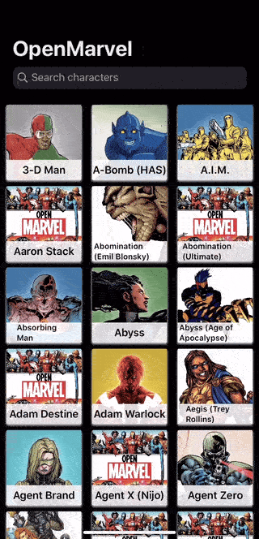
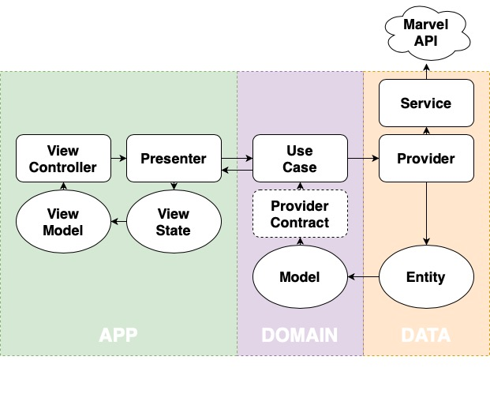

# OpenMarvel
> Open source iOS application for searching Marvel characters.

## 🌟 Features

- [x] List of Marvel characters.
- [x] Detail of a specific character.
- [x] Search for characters by name.
- [x] Sharing information about a character.
- [x] Consult interesting links about a character.
- [x] Compatible with iPhone, iPad and Mac (using Catalyst).
- [x] Compatible with dark mode.
- [x] Open multiple instances of the application simultaneously.

## 🛠 Requirements

- macOS 10.15+
- iOS 13.0+
- Xcode 11.3+

## 🏛 Architecture

It has been implemented using a stateful MVP.

## 📚 Dependencies

**[Moya](https://github.com/Moya/Moya)**, [Docs](https://moya.github.io)

**[Kingfisher](https://github.com/onevcat/Kingfisher)**, [Docs](https://github.com/onevcat/Kingfisher/wiki/Cheat-Sheet)

**[Marvel Comics API](https://developer.marvel.com)**, [Docs](https://developer.marvel.com/docs)

## 👨‍💻 Author

Alex Rupérez – [@alexruperez](https://twitter.com/alexruperez) – contact@alexruperez.com

## 👮‍♂️ License

OpenMarvel is available under the GNU GPLv3 license. See ``COPYING`` file for more information.
